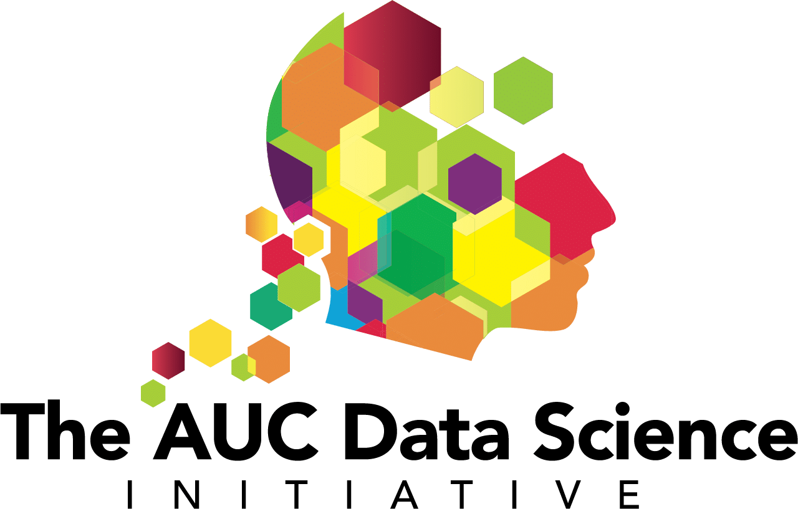
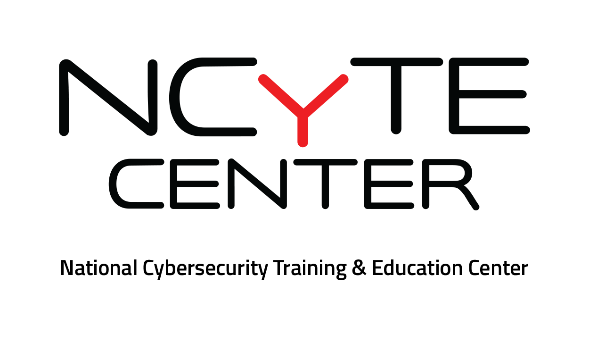
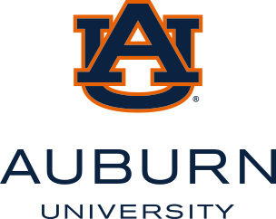

  <h1>Thank You to Our Sponsors</h1>
  

    The ADMI 2026 Symposium is made stronger through the generosity, partnership, and shared vision
    of organizations that believe in advancing computing education, broadening participation in
    technology, and supporting excellence across Minority Serving Institutions. We extend our sincere
    gratitude to our sponsors for helping make this year’s symposium possible.
  

  

    On behalf of the ADMI community, thank you to each of our sponsors for investing in students,
    faculty, research, and the future of innovation. Your support helps create meaningful opportunities
    for collaboration, discovery, and growth throughout the symposium.
  

    <a class="sponsor-card" href="https://www.teachcswithai.org" target="_blank" rel="noopener noreferrer">
      

        
      

      
GenAI in CS Education Consortium

      
Visit Sponsor ↗

    </a>

    <a class="sponsor-card" href="https://datascience.aucenter.edu" target="_blank" rel="noopener noreferrer">
      

        
      

      
AUC Data Science Initiative

      
Visit Sponsor ↗

    </a>

    <a class="sponsor-card" href="https://www.ncyte.net" target="_blank" rel="noopener noreferrer">
      

        
      

      
NCyTE Center

      
Visit Sponsor ↗

    </a>

    <a class="sponsor-card" href="https://sciencegateways.org" target="_blank" rel="noopener noreferrer">
      

        
      

      
SGX3

      
Visit Sponsor ↗

    </a>

    <a class="sponsor-card" href="https://www.statsperform.com" target="_blank" rel="noopener noreferrer">
      

        
      

      
Stats Perform

      
Visit Sponsor ↗

    </a>

    <a class="sponsor-card" href="https://www.auburn.edu" target="_blank" rel="noopener noreferrer">
      

        
      

      
Auburn University

      
Visit Sponsor ↗

    </a>

  Sponsor logos on this page are referenced from the repository directory <code>/sponsorlogos/</code>.

