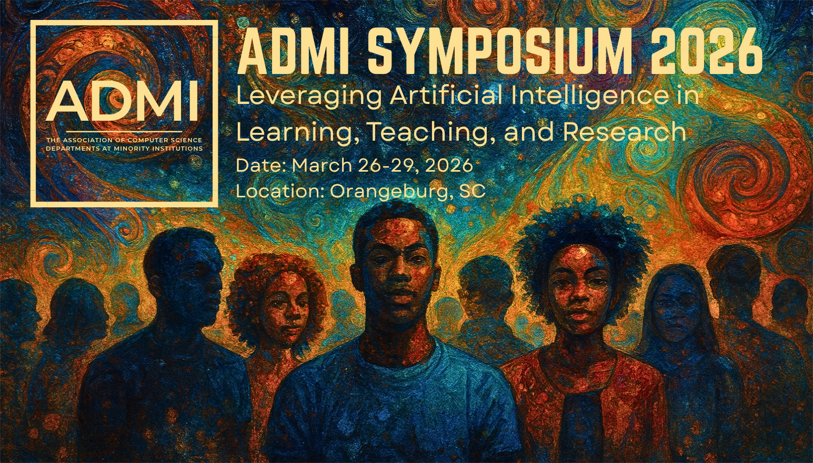

# ADMI 2026 — Accepted Papers
Event Site: <a href="https://admiusa.org/admi2026/index.php">ADMI Symposium 2026</a>  

---

## Full-Oral Presentations

### Faculty

| # | Paper |
|---|-------|
| 12 | [EXPLORING CALCULUS CONCEPTS WITH MAPLE](sorted_papers/Full-Oral/Faculty/ADMI_2026_paper_12.pdf) |
| 13 | [An Optimized Artificial Intelligence Powered iOS Mobile App for Weed Identification](sorted_papers/Full-Oral/Faculty/ADMI_2026_paper_13.pdf) |
| 24 | [Enhancing Computer Science Education through AI-Driven Scaffolding](sorted_papers/Full-Oral/Faculty/ADMI_2026_paper_24.pdf) |
| 25 | [Robust Noise-Resilient Feature Extract and 3D-CNN classification for Hyperspectral imagery](sorted_papers/Full-Oral/Faculty/ADMI_2026_paper_25.pdf) |
| 27 | [Some experimental results for fingerprint image processing](sorted_papers/Full-Oral/Faculty/ADMI_2026_paper_27.pdf) |
| 50 | [Robust Noise-Resilient Feature Extraction and 3D-CNN Classification for Hyperspectral Imagery](sorted_papers/Full-Oral/Faculty/ADMI_2026_paper_50.pdf) |
| 73 | [Using Personalized Generative AI as a "First Responder" in C++ Education to improve student learning](sorted_papers/Full-Oral/Faculty/ADMI_2026_paper_73.pdf) |
| 74 | [The Importance of Course Redesign: Microlearning Strategies for Enhanced Course Design: Insights from the JCSU CITL Summer Workshop](sorted_papers/Full-Oral/Faculty/ADMI_2026_paper_74.pdf) |
| 79 | [Developing Effective Computer Science Program Curricula and AI-Driven Educational Models to Enhance Learning Outcomes](sorted_papers/Full-Oral/Faculty/ADMI_2026_paper_79.pdf) |
| 91 | [Findings from a Feasibility Study on AI-Aligned Experiential Learning at an HBCU](sorted_papers/Full-Oral/Faculty/ADMI_2026_paper_91.pdf) |
| 92 | [Building the Next Generation of Cyber AI Professionals: Lessons from Bowie State University's CyberAI Scholarship For Service Program](sorted_papers/Full-Oral/Faculty/ADMI_2026_paper_92.pdf) |

### Student — Graduate

| # | Paper |
|---|-------|
| 6 | [FORGETTING BY DESIGN: TESTING THE EFFECTIVENESS OF MACHINE UNLEARNING IN RIGHT TO BE FORGOTTEN DATA DELETION](sorted_papers/Full-Oral/Student%20-%20Graduate/ADMI_2026_paper_6.pdf) |
| 7 | [SQL Injection Prevention Techniques](sorted_papers/Full-Oral/Student%20-%20Graduate/ADMI_2026_paper_7.pdf) |
| 20 | [A Hands-On Laboratory Approach to Supporting Student Learning in Computer Vision Education](sorted_papers/Full-Oral/Student%20-%20Graduate/ADMI_2026_paper_20.pdf) |
| 23 | [Investigating Motion-Focused Video Frame Interpolation: Efficiency vs. Fidelity](sorted_papers/Full-Oral/Student%20-%20Graduate/ADMI_2026_paper_23.pdf) |
| 51 | [Integrating Blockchain dApp Development in Cybersecurity Education via Real-World Applications](sorted_papers/Full-Oral/Student%20-%20Graduate/ADMI_2026_paper_51.pdf) |
| 85 | [Advancing Digital Forensics with the Integration of Cyber Threat Intelligence Technologies](sorted_papers/Full-Oral/Student%20-%20Graduate/ADMI_2026_paper_85.pdf) |
| 90 | [Bridging Policy and Practice: The CLASS AlignED Framework for Responsible AI Integration in Higher Education](sorted_papers/Full-Oral/Student%20-%20Graduate/ADMI_2026_paper_90.pdf) |

### Student — Undergraduate

| # | Paper |
|---|-------|
| 1 | [Machine Learning-Based Detection of Business Email Compromise: A Comparative Analysis of Gradient Boosting Techniques](sorted_papers/Full-Oral/Student%20-%20Undergraduate/ADMI_2026_paper_1.pdf) |
| 4 | [AI and Automation in Sports](sorted_papers/Full-Oral/Student%20-%20Undergraduate/ADMI_2026_paper_4.pdf) |
| 5 | [Social Media Misinformation: Trust, Perception, & Public Awareness in the Age of AI](sorted_papers/Full-Oral/Student%20-%20Undergraduate/ADMI_2026_paper_5.pdf) |
| 9 | [Adversarial Patch: Autonomous Vehicles](sorted_papers/Full-Oral/Student%20-%20Undergraduate/ADMI_2026_paper_9.pdf) |
| 22 | [Robots for Outreach](sorted_papers/Full-Oral/Student%20-%20Undergraduate/ADMI_2026_paper_22.pdf) |
| 28 | [Enabling safe Beyond Visual Line of Sight Drone Operations Through AI-Powered Object Detection](sorted_papers/Full-Oral/Student%20-%20Undergraduate/ADMI_2026_paper_28.pdf) |
| 55 | [Enhancing Black-Box Transparency with SHAP and LIME: A Comparative and Practical Review of Explainable AI in Cybersecurity](sorted_papers/Full-Oral/Student%20-%20Undergraduate/ADMI_2026_paper_55.pdf) |
| 63 | [Online Anonymity vs. Online Accountability](sorted_papers/Full-Oral/Student%20-%20Undergraduate/ADMI_2026_paper_63.pdf) |
| 66 | [Feature Effect Visualization in Cybersecurity: A Study of PDP and ICE](sorted_papers/Full-Oral/Student%20-%20Undergraduate/ADMI_2026_paper_66.pdf) |

---

## Poster Presentations

### Student — Graduate

| # | Paper |
|---|-------|
| 57 | [Addressing Fairness and Trustworthiness in The Workplace Using Scalable Blockchain Survey Solutions](sorted_papers/Poster/Student%20-%20Graduate/ADMI_2026_paper_57.pdf) |

### Student — Undergraduate

| # | Paper |
|---|-------|
| 2 | [Machine Learning Diagnosis of Peripheral Arterial Disease from CT-Angiography (CTA) Images](sorted_papers/Poster/Student%20-%20Undergraduate/ADMI_2026_paper_2.pdf) |
| 3 | [AI-Enabled Construction of Aligned Collagen Using Two-Photon Techniques](sorted_papers/Poster/Student%20-%20Undergraduate/ADMI_2026_paper_3.pdf) |
| 11 | [PeerConnect: Optimizing Peer Tutoring with Predictive Analytics and Intelligent Matching](sorted_papers/Poster/Student%20-%20Undergraduate/ADMI_2026_paper_11.pdf) |
| 14 | [Deep Learning in Network Traffic Analysis Using Synthetic Data for Privacy Protection and Cyber Attack Mitigation](sorted_papers/Poster/Student%20-%20Undergraduate/ADMI_2026_paper_14.pdf) |
| 26 | [Enhancing Undergraduate Research Recruitment through NLP-Driven Application Matching](sorted_papers/Poster/Student%20-%20Undergraduate/ADMI_2026_paper_26.pdf) |
| 30 | [Assessing Video LLM Performance in Detecting Child Safety Risks](sorted_papers/Poster/Student%20-%20Undergraduate/ADMI_2026_paper_30.pdf) |
| 31 | [Understanding Object Detection Vulnerabilities in the Age of YOLO v11](sorted_papers/Poster/Student%20-%20Undergraduate/ADMI_2026_paper_31.pdf) |
| 32 | [Limitless: The future of Personalized AI power sports advertisements](sorted_papers/Poster/Student%20-%20Undergraduate/ADMI_2026_paper_32.pdf) |
| 34 | [Perfect Path: An AI-Powered Pose Detection System for Personalized Golf Swing Visualization and Inclusive Sports Engagement](sorted_papers/Poster/Student%20-%20Undergraduate/ADMI_2026_paper_34.pdf) |
| 36 | [Fine-Tuning DistilBERT, DeBERTa and ModernBERT for Valence–Arousal Prediction and Change Estimation](sorted_papers/Poster/Student%20-%20Undergraduate/ADMI_2026_paper_36.pdf) |
| 38 | [Time-Aware Two-Dimensional Packing for Throughput Optimization in Slicing-Aware 3D Printing](sorted_papers/Poster/Student%20-%20Undergraduate/ADMI_2026_paper_38.pdf) |
| 39 | [Disaster Relief AI Chatbot](sorted_papers/Poster/Student%20-%20Undergraduate/ADMI_2026_paper_39.pdf) |
| 40 | [Exploring Prompt Strategies for Joke Generation Under Input Constraints](sorted_papers/Poster/Student%20-%20Undergraduate/ADMI_2026_paper_40.pdf) |
| 41 | [Speech-Based Detection and Severity Assessment of Alzheimer's Disease](sorted_papers/Poster/Student%20-%20Undergraduate/ADMI_2026_paper_41.pdf) |
| 42 | [A.N.T.S. (Autonomous, Navigation, Technician, Swarm)](sorted_papers/Poster/Student%20-%20Undergraduate/ADMI_2026_paper_42.pdf) |
| 43 | [Evidence Guided Abductive Scoring with Option Conditioned Retrieval and Constrained LLM Evaluation](sorted_papers/Poster/Student%20-%20Undergraduate/ADMI_2026_paper_43.pdf) |
| 44 | [Unsupervised People's Speech Challenge: BiMamba2 Masked Spectrogram Model](sorted_papers/Poster/Student%20-%20Undergraduate/ADMI_2026_paper_44.pdf) |
| 46 | [Evaluating Dialect Bias in Commercial Automatic Speech Recognition Systems: A Comparative Analysis of AAVE, Clean, and Noisy Speech](sorted_papers/Poster/Student%20-%20Undergraduate/ADMI_2026_paper_46.pdf) |
| 48 | [Improving Multilingual Medieval Handwriting Recognition through Multimodal Language Modeling](sorted_papers/Poster/Student%20-%20Undergraduate/ADMI_2026_paper_48.pdf) |
| 49 | [Black Press + AI](sorted_papers/Poster/Student%20-%20Undergraduate/ADMI_2026_paper_49.pdf) |
| 52 | [Augmenting Naval Ship Images for Viewing Distance using Adobe Generative Fill](sorted_papers/Poster/Student%20-%20Undergraduate/ADMI_2026_paper_52.pdf) |
| 53 | [Advanced Methods for Top-View RGB-D Person Re-ID (TVRID)](sorted_papers/Poster/Student%20-%20Undergraduate/ADMI_2026_paper_53.pdf) |
| 54 | [Knowledge-Grounded Adverse Drug Event Detection from Clinical Narratives](sorted_papers/Poster/Student%20-%20Undergraduate/ADMI_2026_paper_54.pdf) |
| 60 | [Onboard Multimodal Learning for Data-Driven Decision-Making in Humanoid Robotics](sorted_papers/Poster/Student%20-%20Undergraduate/ADMI_2026_paper_60.pdf) |
| 62 | [Beyond Accuracy: Forensic Evaluation of Trust and Grounding in LLM Outputs](sorted_papers/Poster/Student%20-%20Undergraduate/ADMI_2026_paper_62.pdf) |
| 64 | [Fine-Tuning SimAM-ResNet34 and WavLM-Base for Cross-Lingual Speaker Verification](sorted_papers/Poster/Student%20-%20Undergraduate/ADMI_2026_paper_64.pdf) |
| 65 | [Ensemble Voting and Meta-Learning for Homonym Disambiguation: A Hybrid Approach to SemEval 2026 Task 5](sorted_papers/Poster/Student%20-%20Undergraduate/ADMI_2026_paper_65.pdf) |
| 67 | [Clustering + Adversarial AI](sorted_papers/Poster/Student%20-%20Undergraduate/ADMI_2026_paper_67.pdf) |
| 68 | [THE LANGUAGE FAMILY EFFECT: IMPROVING AFRICAN SENTIMENT MODELS THROUGH LINGUISTIC RELATEDNESS](sorted_papers/Poster/Student%20-%20Undergraduate/ADMI_2026_paper_68.pdf) |
| 69 | [Beyond Visible Spectrum: Developing Computer Vision Techniques for Agricultural Hyperspectral Image Categorization](sorted_papers/Poster/Student%20-%20Undergraduate/ADMI_2026_paper_69.pdf) |
| 70 | [Query Reformulation and Dense-Lexical Retrieval Fusion for Multi-Turn Retrieval-Augmented Generation](sorted_papers/Poster/Student%20-%20Undergraduate/ADMI_2026_paper_70.pdf) |
| 71 | [Artificial Intelligence and the Expanding Digital Divide](sorted_papers/Poster/Student%20-%20Undergraduate/ADMI_2026_paper_71.pdf) |
| 72 | [Denoising and Object Tracking in Adverse Conditions](sorted_papers/Poster/Student%20-%20Undergraduate/ADMI_2026_paper_72.pdf) |
| 75 | [The Impact of AI-Integrated Pre-College Bridge Program on First-Year Student Success](sorted_papers/Poster/Student%20-%20Undergraduate/ADMI_2026_paper_75.pdf) |
| 76 | [CULTURALLY AWARE MULTILINGUAL MODEL ROUTING THROUGH A MIXTURE-OF-SPECIALISTS FRAMEWORK](sorted_papers/Poster/Student%20-%20Undergraduate/ADMI_2026_paper_76.pdf) |
| 77 | [ASR Benchmarking for AAVE](sorted_papers/Poster/Student%20-%20Undergraduate/ADMI_2026_paper_77.pdf) |
| 78 | [The Importance of Adversarial Patch Detection in Cybersecurity Attacks: A Critical Analysis of Machine Learning Vulnerabilities and Defense Mechanisms](sorted_papers/Poster/Student%20-%20Undergraduate/ADMI_2026_paper_78.pdf) |
| 80 | [Detecting Physical Adversarial Patch Attacks with Object Detectors](sorted_papers/Poster/Student%20-%20Undergraduate/ADMI_2026_paper_80.pdf) |
| 81 | [Structural Augmentation for Conspiracy Detection: A ModernBERT Approach to PsyCoMark 2026 Subtask 2](sorted_papers/Poster/Student%20-%20Undergraduate/ADMI_2026_paper_81.pdf) |
| 82 | [Evaluating Perceptions of Naturalness in AI-Generated Speech](sorted_papers/Poster/Student%20-%20Undergraduate/ADMI_2026_paper_82.pdf) |
| 84 | [Cross-Silo Federated Learning for Radiomics](sorted_papers/Poster/Student%20-%20Undergraduate/ADMI_2026_paper_84.pdf) |
| 89 | [AI4PC-Howard University at SemEval-2026 Task 9: Multilingual Polarization Detection via Large Language Model Inference](sorted_papers/Poster/Student%20-%20Undergraduate/ADMI_2026_paper_89.pdf) |
